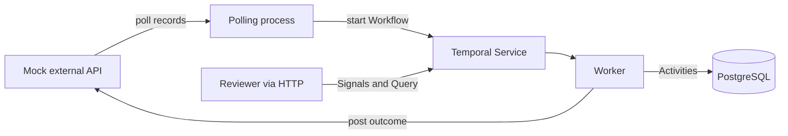
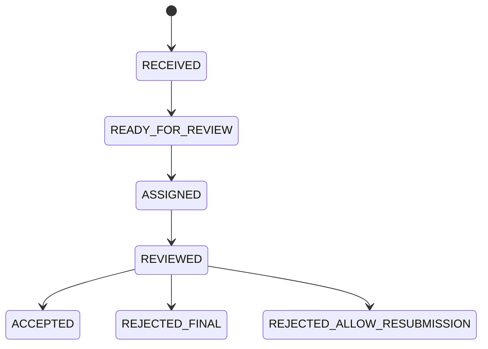

# Temporal human-review workshop starter

This repository is the prepared starting point for a 90-minute, hands-on Temporal workshop. It models records arriving from an external system, human assignment and review, and an outcome sent back to that external system.

Participants write the durable Workflow. The mock external service, polling process, HTTP review API, Temporal Worker, typed Activities, PostgreSQL schema, Prisma client, migrations, and local run scripts are already wired.

## The system you will build

Each external record version gets its own review case and deterministic Temporal Workflow ID. A later update to the same external record starts a new Workflow, such as `review-invoice-1001-v2`, without reopening or overwriting version 1.



The Workflow state machine is:



Both rejection choices are terminal for that record version. `ALLOW_RESUBMISSION` tells the external system that it may send a corrected version; when it does, the poller starts a new review Workflow for that new version.

## What is already set up

| Component | What it does | Location |
| --- | --- | --- |
| Mock external API | Seeds two records, exposes cursor-based polling, accepts new versions, and stores idempotent review outcomes | `src/apps/mock-external-api.ts` |
| Poller | Polls on a configurable interval and starts one Workflow per external record version | `src/apps/poller.ts` |
| Review API | Lists review cases and turns assignment/review HTTP requests into Temporal Signals | `src/apps/api.ts` |
| Activities | Writes review state through Prisma and posts the final outcome to the external API | `src/temporal/activities/review.activities.ts` |
| Worker | Registers the Workflow and Activities on the workshop task queue | `src/apps/worker.ts` |
| PostgreSQL | Runs in Docker with a persistent local volume | `docker-compose.yml` |
| Prisma | Defines the data model, migration, generated client, and PostgreSQL driver adapter | `prisma/` and `prisma.config.ts` |
| Workflow starter | Receives and persists data, exposes a working Query, and waits for participant code | `src/temporal/workflows/review-record.workflow.ts` |

The dependency versions are pinned so workshop machines do not receive different SDK or ORM behavior halfway through the session.

## Prerequisites

- macOS with [Homebrew](https://brew.sh/)
- Node.js 22 or newer
- Docker Desktop (or another Docker runtime with Compose)

The fastest supported local Temporal setup is the Temporal CLI development server. The official TypeScript setup guide uses the same approach: [Temporal TypeScript local setup](https://docs.temporal.io/develop/typescript/set-up-your-local-typescript).

Install the CLI with Homebrew:

```bash
brew install temporal
temporal --version
```

PostgreSQL needs no native macOS installation. The repository runs the official PostgreSQL 17 Alpine image through Docker Compose.

## One-time setup

From the repository root:

```bash
cp .env.example .env
npm install
npm run db:start
npm run db:setup
```

`db:start` waits for PostgreSQL's health check. `db:setup` generates Prisma Client and applies the included migration. The database is available on `localhost:5432` using the development-only credentials in `.env.example`.

Start Temporal in a dedicated terminal:

```bash
npm run temporal:start
```

This wraps `temporal server start-dev`, persists local Workflow history under `.temporal/`, exposes gRPC on `localhost:7233`, and starts the Web UI at [http://localhost:8233](http://localhost:8233). The CLI development server and its Web UI are documented in the [Temporal CLI server reference](https://docs.temporal.io/cli/command-reference/server).

Start all four Node.js processes in another terminal:

```bash
npm run dev
```

Expected services:

| Service | Address |
| --- | --- |
| Review API | [http://localhost:3000](http://localhost:3000) |
| Mock external API | [http://localhost:4000](http://localhost:4000) |
| Temporal Web UI | [http://localhost:8233](http://localhost:8233) |
| PostgreSQL | `localhost:5432` |

Within one polling interval, the two seeded records should appear here:

```bash
curl http://localhost:3000/reviews
```

They initially stay in `RECEIVED`. That is intentional: the prebuilt path proves all infrastructure is connected, and the remaining Workflow behavior is the workshop exercise.

## Session objective

Implement every `WORKSHOP TODO` in:

```text
src/temporal/workflows/review-record.workflow.ts
```

By the end, a Workflow must:

1. Persist the received record and make it `READY_FOR_REVIEW`.
2. Wait durably for an assignment Signal, then persist `ASSIGNED`.
3. Wait durably for a review Signal from the assigned user, then persist `REVIEWED`.
4. Send an accepted record to the external API outcome endpoint.
5. Send a rejection with either `FINAL` or `ALLOW_RESUBMISSION` to that same endpoint.
6. Finish with the matching terminal status in both Workflow state and PostgreSQL.

The signal and query definitions, Activity proxies, input types, retry policy, and sequential outline are already in the file. The TODOs ask you to write the signal handlers, state transitions, durable waits, Activity calls, and final branch.

## Suggested 90-minute agenda

| Time | Work |
| --- | --- |
| 0–10 min | Trace one seeded record through the poller, Temporal Web UI, Activity, and database |
| 10–25 min | Implement `READY_FOR_REVIEW` and inspect Workflow state through the Query |
| 25–45 min | Implement the assignment Signal handler, durable wait, and assignment Activity |
| 45–65 min | Implement review validation, the review Signal handler, and review Activity |
| 65–80 min | Branch across accept, final rejection, and resubmittable rejection; call the outcome Activity |
| 80–90 min | Exercise retries and Worker restarts; inspect Event History and discuss production hardening |

## Exercise guide

### TODO 1: Make the case ready

Call `markReadyForReview` after `receiveData` succeeds. Then replace Workflow `state` with a copy whose status is `READY_FOR_REVIEW`.

Activities perform I/O and can retry. Workflow code must remain deterministic, so do not import Prisma, call `fetch`, or use arbitrary Node.js APIs in the Workflow file. Temporal records Activity commands and their results in Event History.

### TODO 2 and 3: Assign a user

Registering the Signal handler is already scaffolded. Make it accept an assignment only in `READY_FOR_REVIEW`, store the assignment, and update Workflow state to `ASSIGNED`. Treat a duplicate assignment by the same user as harmless.

The existing `condition` is a durable wait. It consumes no polling loop or application thread while the Workflow is idle. After it unblocks, call `markAssigned` to update PostgreSQL.

Temporal's TypeScript guide covers [`defineSignal`, `setHandler`, Queries, and `condition`](https://docs.temporal.io/develop/typescript/workflows/message-passing).

### TODO 4 and 5: Review the data

Accept a review only when the Workflow is `ASSIGNED` and `signalInput.userId` matches the assigned user. Enforce these payload rules:

- `ACCEPT` must not include `rejectionMode`.
- `REJECT` must include `FINAL` or `ALLOW_RESUBMISSION`.

Store the review, update Workflow state to `REVIEWED`, wait for it, and call `markReviewed`.

These endpoints use Signals, so HTTP `202` means Temporal durably accepted the message; it does not mean the whole Workflow is finished. A useful follow-on exercise is replacing Signals with Workflow Updates when the caller needs synchronous validation and a result.

### TODO 6: Deliver and finish

Call `sendReviewOutcome` with the Workflow reference, external record identity, and review. The Activity:

- posts to `POST /records/:externalId/review-outcomes`;
- uses the Workflow ID as an idempotency key;
- persists the terminal status and delivery timestamp;
- returns the final status to the Workflow.

Update the queryable Workflow state and return `ReviewWorkflowResult`. Remove the final never-ending starter guard.

## Drive the completed Workflow

List cases and copy one `id`:

```bash
curl http://localhost:3000/reviews
```

Assign it:

```bash
curl -X POST http://localhost:3000/reviews/REVIEW_CASE_ID/assign \
  -H 'content-type: application/json' \
  -d '{"userId":"alice"}'
```

Inspect its queryable Workflow state:

```bash
curl http://localhost:3000/reviews/REVIEW_CASE_ID/workflow-state
```

Accept it:

```bash
curl -X POST http://localhost:3000/reviews/REVIEW_CASE_ID/review \
  -H 'content-type: application/json' \
  -d '{"userId":"alice","decision":"ACCEPT","notes":"Looks correct"}'
```

Or reject it permanently:

```bash
curl -X POST http://localhost:3000/reviews/REVIEW_CASE_ID/review \
  -H 'content-type: application/json' \
  -d '{"userId":"alice","decision":"REJECT","rejectionMode":"FINAL"}'
```

Or permit resubmission:

```bash
curl -X POST http://localhost:3000/reviews/REVIEW_CASE_ID/review \
  -H 'content-type: application/json' \
  -d '{"userId":"alice","decision":"REJECT","rejectionMode":"ALLOW_RESUBMISSION","notes":"Correct the supplier name"}'
```

Inspect what the mock external system received:

```bash
curl http://localhost:4000/admin/outcomes
```

Create a new record or a new version of an existing record. Reusing `id` increments its external version:

```bash
curl -X POST http://localhost:4000/admin/records \
  -H 'content-type: application/json' \
  -d '{"id":"invoice-1001","title":"Invoice 1001 corrected","payload":{"amount":1250,"currency":"SGD","supplier":"Acme Holdings Pte Ltd"}}'
```

The poll interval comes from `POLL_INTERVAL_MS`. It is five seconds for workshop feedback; set it to `60000` for one minute or any other positive millisecond value.

## Why the boundaries look this way

- The poller is prebuilt as a plain Node.js process because the learning target is the human-review Workflow. Replacing it with a Temporal Schedule or a long-running polling Workflow is a good extension.
- PostgreSQL is a queryable application read model. Temporal Event History remains the source of truth for orchestration progress.
- Every external version has a deterministic Workflow ID. The poll cursor advances only after Temporal accepts the start, so a crash between those operations safely retries instead of losing data.
- Database writes and HTTP calls are Activities. Their five-attempt exponential retry policy is visible next to `proxyActivities` in the Workflow.
- The mock outcome endpoint honors an idempotency key. This matters if the HTTP request succeeds but the Activity process dies before Temporal records completion.

## Useful commands

```bash
npm run check            # Generate Prisma Client, type-check, bundle the Workflow, run tests
npm run db:studio        # Browse review cases at http://localhost:5555
npm run db:logs          # Follow PostgreSQL logs
npm run db:stop          # Stop PostgreSQL without deleting its volume
npm run workflow:bundle-check
```

The test file contains TODO test names as an acceptance checklist. A further exercise can replace them with Temporal's time-skipping integration tests; the official [TypeScript testing guide](https://docs.temporal.io/develop/typescript/best-practices/testing-suite) shows how to register mocked Activities with a test Worker.

## Production topics deliberately left out

This is a teaching scaffold, not a deployment reference. A production version still needs authentication and authorization, secrets management, TLS, structured observability, dead-letter or alerting policy, pagination and backpressure, Workflow code versioning, graceful service readiness, and a real external API contract. It should also decide whether Signals or synchronous Workflow Updates best match the product's validation requirements.
